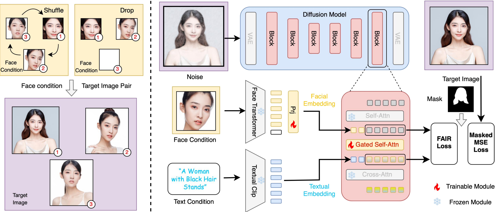

# 📝 Publications

A full publication list is available on my [google scholar](https://scholar.google.com.hk/citations?user=NB9Mn5MAAAAJ&hl=zh-CN) page.

<!-- Paper 1 -->

Open-Source Project

[**Open-Source Project**] [FaceChain: A Playground for Human-centric Artificial Intelligence Generated Content](https://github.com/modelscope/facechain) \\

[[ModelScope Studio]](https://modelscope.cn/studios/CVstudio/FaceChain-FACT)
[[Alibaba Cloud‌ API]](https://help.aliyun.com/zh/model-studio/facechain-quick-start)
[[HuggingFace Space]](https://huggingface.co/spaces/modelscope/FaceChain-FACT)
  

- FaceChain is a novel framework for generating identity-preserved human portraits.
- FaceChain has both high controllability and authenticity in portrait generation, including text-to-image and inpainting based pipelines, and is seamlessly compatible with ControlNet and LoRAs.

<!-- Paper 2 -->

ICCV 2023

[**ICCV 2023**] [TransFace: Calibrating Transformer Training for Face Recognition from a Data-Centric Perspective](https://openaccess.thecvf.com/content/ICCV2023/html/Dan_TransFace_Calibrating_Transformer_Training_for_Face_Recognition_from_a_Data-Centric_ICCV_2023_paper.html) \\
**Jun Dan**, Yang Liu, Haoyu Xie, Jiankang Deng, Haoran Xie, Xuansong Xie, Baigui Sun \\

[[**ModelScope**]](https://www.modelscope.cn/models/iic/cv_vit_face-recognition)
[[Code in FaceChain Rep.]](https://github.com/modelscope/facechain/tree/main/face_module/TransFace)
[[阿里云]](https://developer.aliyun.com/article/1319924)
[[CSDN]](https://blog.csdn.net/sunbaigui/article/details/136556006)

- TransFace is a cutting-edge facial representation extractor in the AIGC era, designed to capture fine-grained facial features at the patch-level.
- TransFace is integrated in [FaceChain](https://github.com/modelscope/facechain) as a key identity-preserved module to assist Stable Diffusion in generating human portraits with fine-grained facial details and diverse styles.
- **Industry Impact:** TransFace model has reached over **15K+** downloads on the [**ModelScope**](https://www.modelscope.cn/models/iic/cv_vit_face-recognition) platform, and has been applied in various facial AIGC projects, such as [Alibaba Tongyi Wanxiang (通义万象写真馆)](https://tongyi.aliyun.com/wanxiang/), [FaceChain](https://github.com/modelscope/facechain), Fliggy (飞猪数字旅拍), etc.

<!-- Paper 3 -->

NeurIPS 2024 

[**NeurIPS 2024**] [TopoFR: A Closer Look at Topology Alignment on Face Recognition](https://proceedings.neurips.cc/paper_files/paper/2024/hash/419b6c974712adb884bfbbeea8e94d1b-Abstract-Conference.html) \\
**Jun Dan**, Yang Liu, Jiankang Deng, Haoyu Xie, Siyuan Li, Baigui Sun, Shan Luo

[[机器之心]](https://www.jiqizhixin.com/articles/2024-10-17-6) 
[[CVer]](https://mp.weixin.qq.com/s/3NegnpJUGPfI_dOfkp_4LQ) 
[[CSDN]](https://blog.csdn.net/sunbaigui/article/details/143230746?spm=1001.2014.3001.5502)

- TopoFR is the first attempt to leverage the powerful and substantial structure information hidden in large-scale face dataset to improve the generalization performance of face recognition models.
- TopoFR achieves SOTA performance on various face benchmarks.

<!-- Paper 4 -->

NeurIPS 2024 

[**NeurIPS 2024**] [TFGDA: Exploring Topology and Feature Alignment in Semi-supervised Graph Domain Adaptation through Robust Clustering](https://proceedings.neurips.cc/paper_files/paper/2024/hash/59e73ff865b56cba6ab7f6b2cce1425d-Abstract-Conference.html) \\
**Jun Dan**, Weiming Liu, Chunfeng Xie, Hua Yu, Shunjie Dong, Yanchao Tan

- TFGDA is an advanced graph transfer learning framework that leverages the intrinsic topological structure information embedded in graphs to improve model generilization performance across domains.
- TFGDA showcases superior performance on multiple transfer learning benchmarks.

<!-- Paper 5 -->

ACM MM 2024 

[**ACM MM 2024**] [HOGDA: Boosting Semi-supervised Graph Domain Adaptation via High-Order Structure-Guided Adaptive Feature Alignment](https://dl.acm.org/doi/abs/10.1145/3664647.3680765) \\
**Jun Dan**, Weiming Liu, Mushui Liu, Chunfeng Xie, Shunjie Dong, Guofang Ma, Yanchao Tan, Jiazheng Xing

- HOGDA is a novel graph transfer learning framework that incorporates a high-order structure information mixing module, effectively capturing abundant structure information in graphs and greatly enhancing the feature extractor's adaptability across different domains.
- HOGDA demonstrates remarkable transfer performance on various benchmarks.

